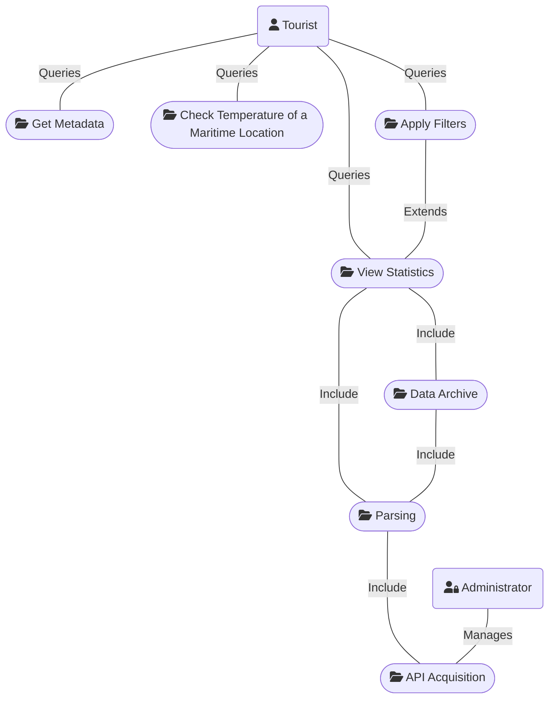
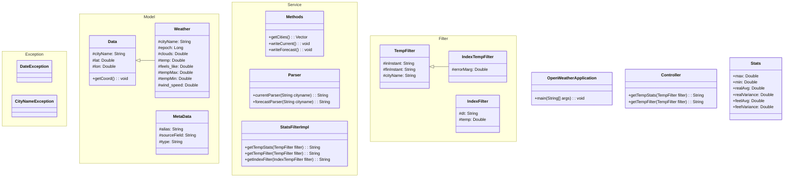
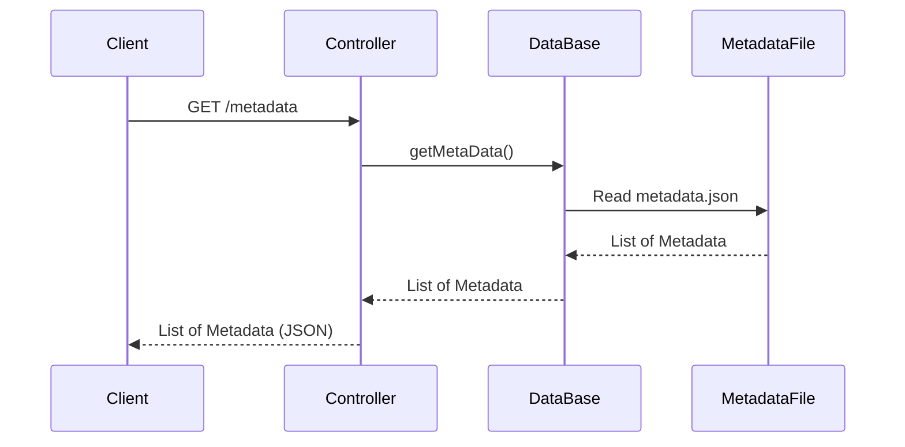
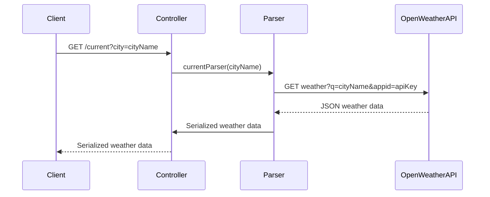
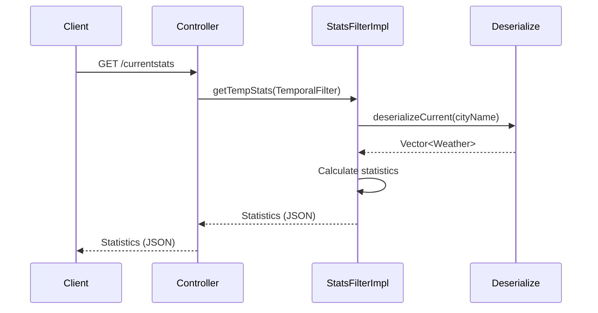
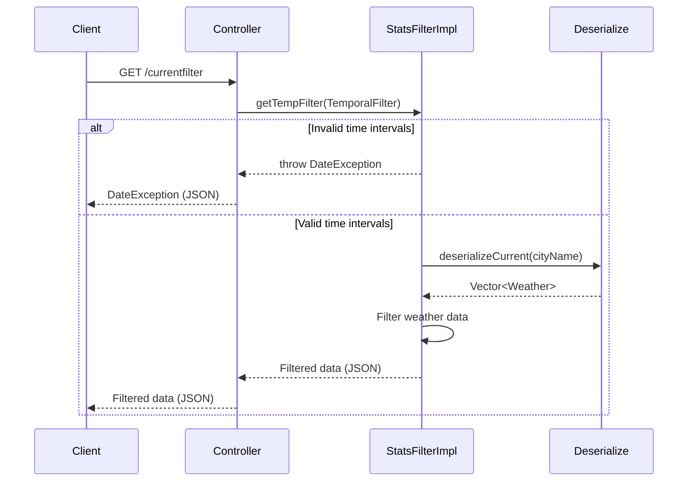
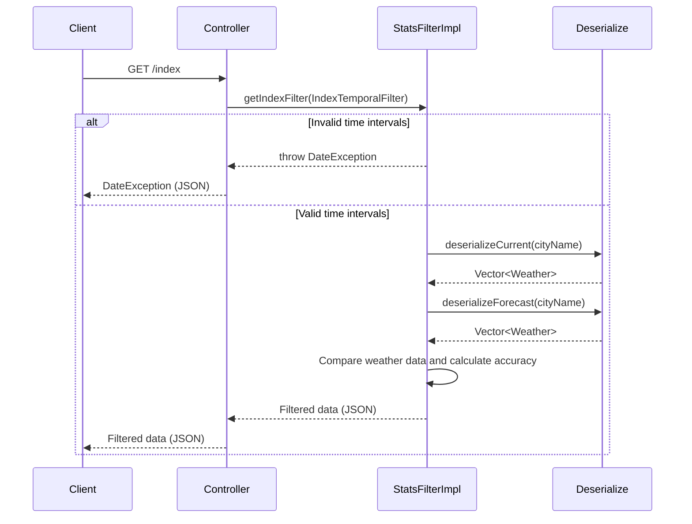

# OpenWeather


> **Progetto sviluppato per l'appello del 25 Gennaio 2021 di Programmazione ad Oggetti.**

[](LICENSE)
[](https://spring.io/projects/spring-boot)
[](https://www.oracle.com/java/technologies/javase-jdk11-downloads.html)

---

## Generalità

OpenWeather è un Web Service RESTful sviluppato utilizzando **SpringBoot** per facilitare la creazione e l'esecuzione di applicazioni Spring. Il servizio sfrutta i dati forniti dalle [API di OpenWeather](https://openweathermap.org/price#weather) per rispondere alle richieste HTTP da parte di client come Postman o siti web.

## Introduzione a Spring e Spring Boot

**Spring** è un framework open source per lo sviluppo di applicazioni Java EE. Fornisce supporto completo per lo sviluppo di applicazioni aziendali robuste e scalabili. Spring semplifica lo sviluppo tramite un'architettura modulare e l'inversione del controllo (IoC), che promuove una maggiore testabilità e manutenzione del codice.

**Spring Boot** è un progetto della famiglia Spring che facilita la creazione di applicazioni stand-alone, production-ready, con il minimo sforzo di configurazione. Fornisce una serie di caratteristiche chiave:

- **Configurazione Automatica**: Spring Boot può automaticamente configurare la tua applicazione in base alle dipendenze specificate.
- **Dipendenze Starter**: Gestisce le dipendenze per te, permettendoti di includere facilmente le librerie necessarie per la tua applicazione.
- **Server Embedded**: Viene fornito con Tomcat, Jetty o Undertow, eliminando la necessità di un container web esterno.
- **Actuator**: Fornisce funzioni pronte all'uso per monitorare e gestire la tua applicazione.

## Sviluppo

Per garantire l'uso didattico del nostro applicativo, abbiamo salvato in locale chiamate "pre-filtrate" alle API di OpenWeather. Nello specifico, il nostro archivio è stato popolato dal 2 gennaio 2021 al 10 gennaio 2021 tramite:

- **Chiamate Forecast**: eseguite a cadenza settimanale, filtrate per ottenere solo dati giornalieri.
- **Chiamate Current**: eseguite a cadenza oraria, ogni nuova ora del giorno.

## Utilizzo

### Diagramma dei Casi d'Uso

#### Descrizione del Diagramma dei Casi d'Uso

Il diagramma dei casi d'uso rappresenta le interazioni principali tra gli utenti e il sistema OpenWeather.

#### Attori e Casi d'Uso

1. **Turista**:
   - **Ottiene Metadata**: Recupera i metadati dei dati disponibili.
   - **Consulta le temperature di una località marittima**: Verifica le temperature attuali di una località specifica.
   - **Consulta statistiche**: Visualizza statistiche delle temperature per una località.
     - **Applica filtri**: Filtra le statistiche per ottenere informazioni specifiche (estende "Consulta statistiche").

2. **Amministratore**:
   - **Acquisizione dati da API**: Acquisisce dati dalle API di OpenWeather.

#### Interazioni tra i Casi d'Uso

- **Archivio Dati**: 
  - Incluso in "Consulta statistiche" e "Applica filtri" per accedere ai dati salvati.
- **Parsing**: 
  - Incluso in "Archivio Dati" e "Acquisizione dati da API" per elaborare i dati ricevuti.

Il diagramma evidenzia come i turisti ottengono informazioni meteorologiche e statistiche, e come l'amministratore gestisce l'acquisizione e l'archiviazione dei dati.



## Struttura Interna

### Diagramma delle Classi

Il seguente diagramma delle classi rappresenta la struttura interna del sistema OpenWeather; illustra le relazioni tra queste classi e come collaborano per fornire le funzionalità del sistema OpenWeather.



### Descrizione delle rotte

L'applicativo permette di interrogare il DataSet locale, appositamente creato, tramite metodi GET e POST per ottenere:

- Informazioni sui **metadata** dei dati ricevuti.
- **Previsioni attuali** per una città specifica.
- **Statistiche** (media, varianza, temperature massima e minima) per una città in un periodo di tempo definito dall'utente.
- Numero di **previsioni azzeccate** rispetto a un margine di errore fornito dall'utente.
- **Filtraggio del DataSet** storico locale.

| TIPO | ROTTA | DESCRIZIONE |
|------|-------|-------------|
| GET | `/metadata` | Restituisce l'elenco degli attributi dei dati input e output. |
| GET | `/current` | Interroga le API fornendo il nome della città per ottenere previsioni attuali. |
| GET | `/currentstats` | Restituisce statistiche sulle temperature basate sui filtri del body della richiesta. |
| GET | `/currentfilter` | Restituisce le previsioni orarie di una città filtrate secondo il body della richiesta. |
| GET | `/index` | Restituisce l'accuratezza della previsione effettuata in base all'errore passato nel body della richiesta. |

### Filtri Applicabili

| ROTTA | OPERATORE | DESCRIZIONE | ESEMPIO |
|-------|-----------|-------------|---------|
| `/currentstats` | cityName, inInstant, finInstant | Nome della città e intervallo temporale di ricerca. | `{"cityName":"Ancona","inInstant": "03/01/2021 10:00:00","finInstant":"06/01/2021 10:00:00"}` |
| `/currentfilter` | cityName, inInstant, finInstant | Nome della città e intervallo temporale di ricerca. | `{"cityName":"Ancona","inInstant": "02/01/2021 10:00:00","finInstant":"04/01/2021 21:00:00"}` |
| `/index` | cityName, inInstant, finInstant, errorMarg | Nome della città, intervallo temporale e margine di errore della previsione. | `{"cityName": "Ancona","inInstant": "02/01/2021 10:00:00","finInstant": "10/01/2021 00:00:00","errorMarg": 5}` |

> **NOTA**: La rotta `/currentfilter`, in assenza di intervallo temporale fornito, restituisce l'intero DataSet locale.

## Funzionamento Interno

### Diagramma delle Sequenze

- **GET /metadata**


*Rotta:*

```bash
GET /metadata
```

*Risposta:*

```json
[
    {
        "name": "cityName",
        "description": "Nome della citta",
        "type": "String"
    },
    {
        "name": "dt",
        "description": "Periodo di riferimento",
        "type": "String"
    },
    {
        "name": "clouds",
        "description": "Nuvolosità della città nel periodo considerato",
        "type": "String"
    },
    {
        "name": "temp",
        "description": "Temperatura della città nel periodo considerato",
        "type": "String"
    },
    {
        "name": "feels_like",
        "description": "Temperatura percepita della città nel periodo considerato",
        "type": "String"
    },
    {
        "name": "tempMax",
        "description": "Temperatura massima della città nel periodo considerato",
        "type": "String"
    },
    {
        "name": "tempMin",
        "description": "Temperatura minima della città nel periodo considerato",
        "type": "String"
    },
    {
        "name": "wind_speed",
        "description": "Ventosità della città nel periodo considerato",
        "type": "String"
    },
    {
        "name": "inInstant",
        "description": "Inizio intervallo di ricerca nel formato dd/MM/yy HH:mm:ss",
        "type": "String"
    },
    {
        "name": "finInstant",
        "description": "Fine intervallo di ricerca nel formato dd/MM/yy HH:mm:ss",
        "type": "String"
    },
    {
        "name": "max",
        "description": "Temperatura massima nell'intervallo richiesto",
        "type": "double"
    },
    {
        "name": "min",
        "description": "Temperatura minima nell'intervallo richiesto",
        "type": "double"
    },
    {
        "name": "realAvg",
        "description": "Media delle temperature reali nell'intervallo richiesto",
        "type": "double"
    },
    {
        "name": "realVariance",
        "description": "Varianza delle temperature reali nell'intervallo richiesto",
        "type": "double"
    },
    {
        "name": "feelAvg",
        "description": "Media delle temperature percepite nell'intervallo richiesto",
        "type": "double"
    },
    {
        "name": "feelVariance",
        "description": "Varianza delle temperature percepite nell'intervallo richiesto",
        "type": "double"
    },
    {
        "name": "errorMarg",
        "description": "Errore marginale nel calcolo delle previsioni rispetto alla realtà",
        "type": "double"
    },
    {
        "name": "dateIn",
        "description": "Inizio intervallo di ricerca nel formato dd/MM/yy",
        "type": "String"
    },
    {
        "name": "dateFin",
        "description": "Fine intervallo di ricerca nel formato dd/MM/yy",
        "type": "String"
    },
    {
        "name": "correct",
        "description": "Quantità di previsioni azzeccate nell'intervallo richiesto",
        "type": "int"
    },
    {
        "name": "uncorrectTemp",
        "description": "Vettore di temperature non azzeccate in base all'errore dato",
        "type": "Vector<Double>"
    }
]
```

- **GET /current**?city=cityName


*Rotta:*

```bash
GET /current
```

*Params:*

```bash
?city=Termoli
```

*Risposta:*

```json
{
    "dt": 1722065374,
    "clouds": 0.0,
    "temp": 305.81,
    "feels_like": 304.37,
    "tempMax": 305.81,
    "tempMin": 305.81,
    "wind_speed": 0.83,
    "cityName": "\"Termoli\"",
    "lat": 41.9888,
    "lon": 14.9895
}
```

- **POST /currentstats**


*Rotta:*

```bash
GET /currentstats
```

*Body:*

```json
{
    "cityName":"Ancona",
    "inInstant": "03/01/2021 10:00:00",
    "finInstant":"06/01/2021 10:00:00"
}
```

*Risposta:*

```json
{
    "max": 285.37,
    "min": 274.15,
    "realAvg": 279.24,
    "realVariance": 3.71,
    "feelAvg": 276.83,
    "feelVariance": 4.85
}
```

- **POST /currentfilter**


*Rotta:*

```bash
GET /currentfilter
```

*Body:*

```bash
{
    "cityName":"Ancona",
    "inInstant": "02/01/2021 10:00:00",
    "finInstant":"02/01/2021 21:00:00"
}
```

*Risposta:*

```json
[
    {
        "dt": 1609613999,
        "clouds": 100.0,
        "temp": 282.07,
        "feels_like": 280.64,
        "tempMax": 283.71,
        "tempMin": 279.82,
        "wind_speed": 1.0,
        "cityName": "\"Provincia di Ancona\"",
        "lat": 43.55,
        "lon": 13.17
    },
    {
        "dt": 1609617599,
        "clouds": 100.0,
        "temp": 281.91,
        "feels_like": 279.45,
        "tempMax": 283.15,
        "tempMin": 279.82,
        "wind_speed": 2.1,
        "cityName": "\"Provincia di Ancona\"",
        "lat": 43.55,
        "lon": 13.17
    }
]
```

- **POST /index**


*Rotta:*

```bash
GET /index
```

*Body:*

```json
{
    "cityName": "Ancona",
    "inInstant": "02/01/2021 10:00:00",
    "finInstant": "10/01/2021 00:00:00",
    "errorMarg": 5
}
```

*Risposta:*

```json
{
    "startDate": "02-01-2021",
    "endDate": "10-01-2021",
    "countCorrect": 7,
    "countUncorrect": 1,
    "uncorrectTemp": [
        5.01
    ]
}
```

---

## Licenza

Questo progetto è sotto licenza MIT. Vedi il file [LICENSE](LICENSE) per maggiori dettagli.

---

## 👥 Autori 

|Nome | GitHub |
|-----------|--------|
| 👨 `Iasenzaniro Andrea` | [Click here](https://github.com/AndreaIasenzaniro) |
| 👨 `Gissi Carlo` | [Click here](https://github.com/CarloGissi) |
